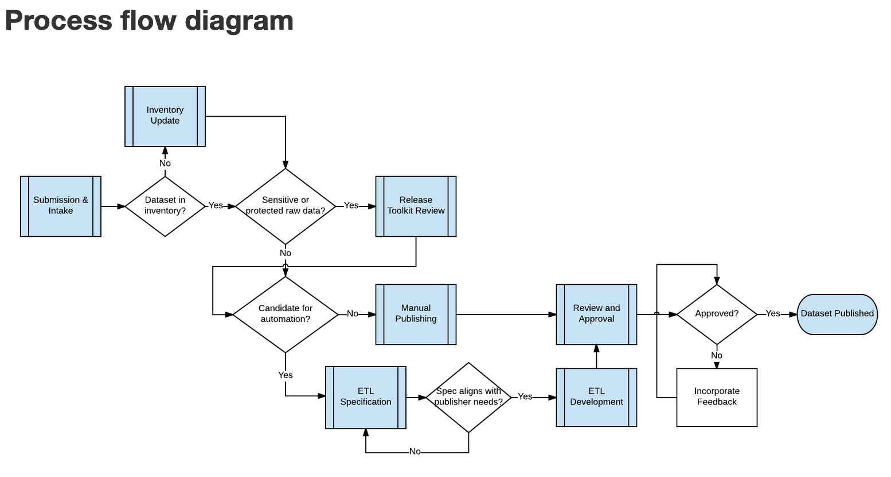

## Project Goals

After iterating on DataSF's approach to publishing open data, the process began to stabilize. We needed a way to capture our approach for a handful of reasons:

1. Clarify and improve consistency in the process across the team
2. Provide a means to transparently document updates to the process
3. Share our approach with other organizations

## Approach

The toolkit was not developed in a vaccuum. We had been developing and documenting the open data publishing program over time, experimenting with and improving on it. But documentation was scattered in various Google docs. These scattered documents also missed the forest for the trees. 

We had done enough lean experimentation that we set out to cohesively describe the publishing program. It was after adopting Trello as a common tool for managing data pipelines that we were able to step back and pull together all of the pieces into a common operating document. This included [describing the process](https://datasf.gitbooks.io/datasf-publishing-toolkit/content/0_publishing_process_overview/) and the [technologies that support the process](https://datasf.gitbooks.io/datasf-publishing-toolkit/content/technology/).

*In the toolkit document, a process diagram [pictured above] and index of processes helps staff visualize how the pieces fit together.*

We chose GitBook as the documentation tool as it provided transparent authoring, version control and ease of sharing.

After completion, [I announced the toolkit through a blog post](https://datasf.org/blog/part-1-datasfs-operating-manual-for-open-data/). While not intended for a general audience, we found that many other governments wanted to more about open data operations as they built out their own programs. *I also fundamentally believe collective learning increases with sharing.*

## Outcomes

Having the toolkit helped with a number of things:

1. **Decreased time spent explaining our operations to peers.** Now we had a document we could send along and focus on answering questions that the document didn't cover. As a side effect, we could update our documents for clarity based on questions and feedback.
2. **Improved onboarding of new staff.** The document in tandem with the Trello board provided a common starting point for new staff to pick up processes. While the document is holistic, it is also modular. This allows us to zoom into pieces of the process for training without losing the bigger picture.
3. **Improved delivery consistency.** With documentation and some process automation, we were able to consistently communicate with our clients about the process and what to expect based on their intake form. Standard checklists in Trello complement the toolkit and help to make sure we don't miss anything.

## Out in the world

<blockquote class="twitter-tweet" data-lang="en">
.<a href="https://twitter.com/DataSF?ref_src=twsrc%5Etfw">@datasf</a> is on a sharing roll (per usual). 🙌🏼 Great resources being shared on how to think about and run <a href="https://twitter.com/hashtag/open?src=hash&amp;ref_src=twsrc%5Etfw">#open</a> data programs for <a href="https://twitter.com/hashtag/OpenDataDay?src=hash&amp;ref_src=twsrc%5Etfw">#OpenDataDay</a>! <a href="https://t.co/5MpA6dorKY">https://t.co/5MpA6dorKY</a>
&mdash; Lilian Coral (@lcoral) <a href="https://twitter.com/lcoral/status/969963345418731520?ref_src=twsrc%5Etfw">March 3, 2018</a></blockquote>
